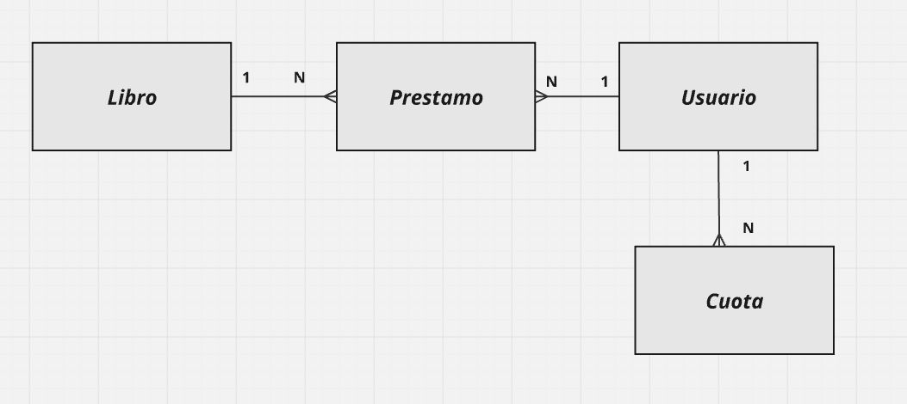

# Proyecto Final - Biblioteca
## Integrantes
- Ulises Fossati
- Martin Alcaraz
- Nicolas Agustin
- Santiago Larrazabal

## Contenidos
- [Diseño Esperado](#diseño-esperado)
- [Normalizacion](#normalizacion)
- [DBML](#dbml)
- [Levantar Proyecto](#levantar-proyecto)

## Diseño Esperado

Identifica entidades fuertes y débiles, atributos, relaciones y cardinalidades.


### **Entidades Fuertes**
**Usuarios**
   - **Descripcion:** Representa a los usuarios que realizan prestamos en la biblioteca 
   - **Atributos:**  
     - `dni` (pk)  
     - `nombre`  
     - `apellido` 
     - `email`
     - `telefono` 
     - `fecha_registro`

**Libros**
   - **Descripcion:** Representa los libros disponibles en la biblioteca  
   - **Atributos:**  
     - `lid` (pk) 
     - `titulo`  
     - `autor`  
     - `genero`  
     - `editorial`  
     - `anio_publicacion`

**Cuotas**
   - **Descripcion:** Representa los pagos asociados a los usuarios.  
   - **Atributos:**  
     - `id` (pk)
     - `dni_usuario` (fk de `Usuarios.dni`) 
     - `monto`  
     - `mes` 
     - `anio` 
     - `estado_pago` (enum: `PENDIENTE`, `PAGADO`)

### Cardinalidades



**Usuarios** (1) - **Prestamos** (N):
   - Un usuario puede realizar varios préstamos, pero cada préstamo está asociado a un único usuario. 

**Libros** (1) - **Prestamos** (N):
   - Un libro puede estar asociado a varios prestamos, pero cada prestamo tiene un unico libro.  

**Usuarios** (1) - **Cuotas** (N)
   -  Un usuario puede tener mUltiples cuotas asignadas (por cada mes/año), pero cada cuota pertenece a un Unico usuario.  

### **Entidad Debil**
 **Prestamos**
   - **Descripcion:** Representa los prestamos realizados por los usuarios. Depende de las entidades usuarios y libros.  
   - **Atributos:**  
     - `id` (pk)
     - `dni_usuario` (fk `Usuarios.dni`)  
     - `lid` (fk `Libros.lid`)  
     - `fecha_prestamo`
     - `fecha_devolucion` (viene NULL por defecto)  

---


## Normalizacion
El diseño de la base de datos cumple con las tres primeras formas normales (1NF, 2NF y 3NF), garantizando que el esquema de la base de datos este optimizado, sin redundancias y con integridad referencial. Ahora explicaremos como hicimos para cumplir con cada una de las formas normales.

---

### **1NF**  
La **1NF** requiere:
1. Todos los atributos deben contener valores atómicos.
2. Cada registro debe ser unico y tener un identificador unico (clave primaria).
3. No deben existir listas o conjuntos dentro de una columna.

**Como se cumple en este esquema:**
- Cada tabla tiene un identificador único (`PRIMARY KEY`):
  - **Usuarios:** `dni`.  
  - **Libros:** `lid`.  
  - **Prestamos:** `id`.  
  - **Cuotas:** `id`.
- Los atributos contienen valores atómicos, por ejemplo:
  - En `Usuarios`, `email` es un unico correo, no una lista de correos.
  - En `Libros`, `titulo`, `autor` y `genero` son valores unicos y no compuestos.
  - En `Prestamos`, `fecha_prestamo` y `fecha_devolucion` son fechas especificas para cada registro.

---

### **2NF**  
La **2NF** requiere:
1. Cumplir con la **1NF**.
2. Todos los atributos no clave deben depender completamente de la clave primaria (evitar dependencias parciales en claves compuestas).

**Cómo se cumple en este esquema:**
- Todas las tablas tienen claves primarias simples:
  - `Usuarios.dni` identifica de forma única a cada usuario.
  - `Libros.lid` identifica de forma única cada libro.
  - `Prestamos.id` identifica de forma única cada préstamo.
  - `Cuotas.id` identifica de forma única cada registro de cuota.
- Todos los atributos dependen exclusivamente de la clave primaria:
  - En `Usuarios`, `nombre`, `apellido`, `email` y `telefono` dependen únicamente de `dni`.
  - En `Libros`, `titulo` y `autor` dependen únicamente de `lid`.

---

### **3NF**  
La **3NF** requiere:
1. Cumplir con la **2NF**.
2. No deben existir dependencias transitivas (los atributos no clave deben depender únicamente de la clave primaria).

**Cómo se cumple en este esquema:**
- No hay dependencias transitivas:
  - En `Usuarios`, todos los atributos (`nombre`, `apellido`, etc.) dependen directamente de `dni`.
  - En `Libros`, todos los atributos dependen directamente de `lid`.
  - En `Prestamos`, los atributos (`fecha_prestamo`, `fecha_devolucion`) dependen únicamente de `id`.
  - En `Cuotas`, todos los atributos dependen de `id`. Además, el par `(dni_usuario, mes, anio)` está definido como único para evitar inconsistencias.

## DBML


## Levantar Proyecto

1. **Clonando el repositorio, te vas a encontrar con la carpeta Proyecto Final, entra en ella.**
```bash
cd '.\Proyecto Final\'
```

2. **Correr en MySQL, los 3 scripts que se encuentran en la carpeta [SQL](sql)** (En orden):
    - schema.sql
    - procedures.sql
    - testingdata.sql

3. **Crear un entorno virtual:**
```bash
python -m venv venv
```

4. **Activar el entorno virtual:**
```bash
.\venv\Scripts\Activate
```

5. **Instalar las dependencias**:
```bash
pip install -r requirements.txt
```

6. **En el archivo [Database.py](database.py), modificar las credenciales de la base de datos:**
```python
self.conn = mysql.connector.connect(
        host=tu_host,
        user=tu_user,
        password=tu_password,
        database="biblioteca",
        port=tu_port,
)
```

7. **Por ultimo correr la aplicacion:**
```bash
py app.py
```

